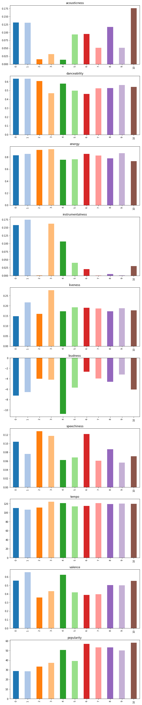
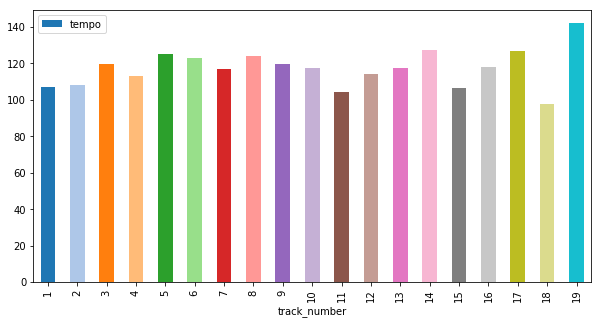
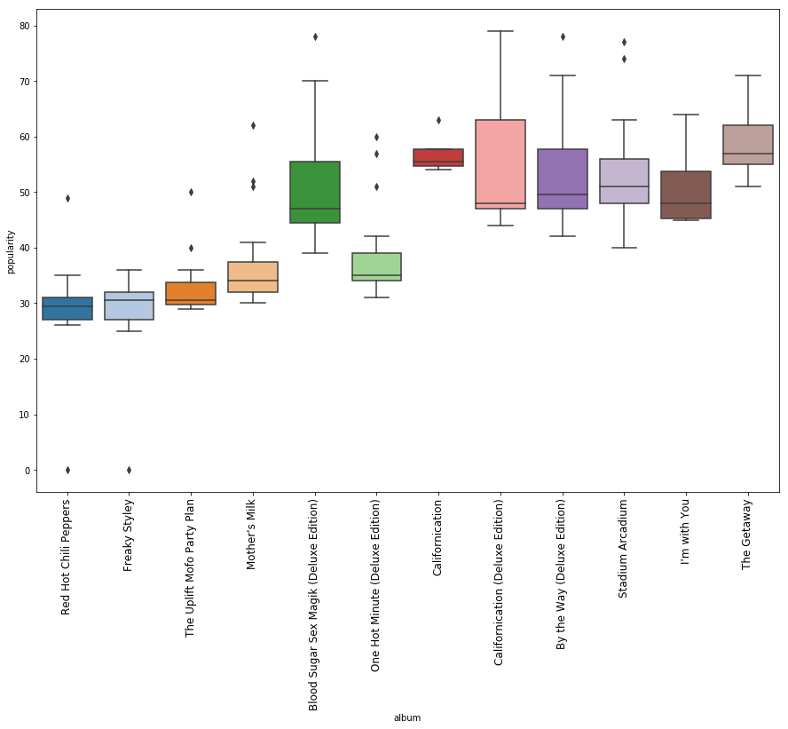
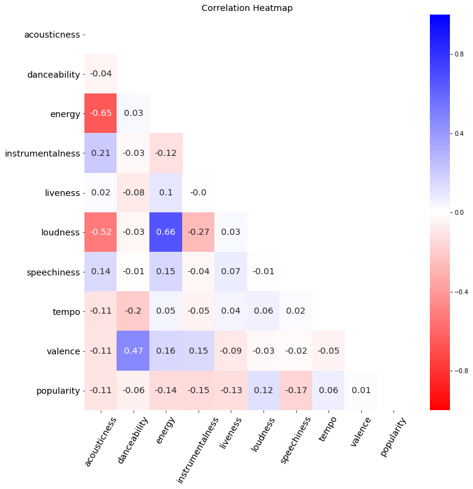

```python
import spotipy
from spotipy.oauth2 import SpotifyClientCredentials #To access authorised Spotify data

client_id = 'b6ea55f0081b45539a332dd5ef4b826c'
client_secret = '44442269cb3b493d9bd709c24257e4d2'
client_credentials_manager = SpotifyClientCredentials(client_id=client_id, client_secret=client_secret)

sp = spotipy.Spotify(client_credentials_manager=client_credentials_manager) #spotify object to access API
name = "Red Hot Chili Peppers" #chosen artist
result = sp.search(name) #search query
result['tracks']['items'][0]['artists']
```


    [{'external_urls': {'spotify': 'https://open.spotify.com/artist/0L8ExT028jH3ddEcZwqJJ5'},
      'href': 'https://api.spotify.com/v1/artists/0L8ExT028jH3ddEcZwqJJ5',
      'id': '0L8ExT028jH3ddEcZwqJJ5',
      'name': 'Red Hot Chili Peppers',
      'type': 'artist',
      'uri': 'spotify:artist:0L8ExT028jH3ddEcZwqJJ5'}]


```python
#Extract Artist's uri
artist_uri = result['tracks']['items'][0]['artists'][0]['uri']
#Pull all of the artist's albums
sp_albums = sp.artist_albums(artist_uri, album_type='album',)
#Store artist's albums' names' and uris in separate lists
album_names = []
album_uris = []
album_release_date = []
for i in range(len(sp_albums['items'])):
    album_names.append(sp_albums['items'][i]['name'])
    album_uris.append(sp_albums['items'][i]['uri'])
    album_release_date.append(sp_albums['items'][i]['release_date'])

# Keep names and uris in same order to keep track of duplicate albums
```


```python
def albumSongs(uri):
    album = uri #assign album uri to a_name
    spotify_albums[album] = {} #Creates dictionary for that specific album
#Create keys-values of empty lists inside nested dictionary for album
    spotify_albums[album]['album'] = [] #create empty list
    spotify_albums[album]['album_release_date'] = []
    spotify_albums[album]['track_number'] = []
    spotify_albums[album]['id'] = []
    spotify_albums[album]['name'] = []
    spotify_albums[album]['uri'] = []
    tracks = sp.album_tracks(album) #pull data on album tracks
    for n in range(len(tracks['items'])): #for each song track
        spotify_albums[album]['album'].append(album_names[album_count]) #append album name tracked via album_count
        spotify_albums[album]['album_release_date'].append(album_release_date[album_count])
        spotify_albums[album]['track_number'].append(tracks['items'][n]['track_number'])
        spotify_albums[album]['id'].append(tracks['items'][n]['id'])
        spotify_albums[album]['name'].append(tracks['items'][n]['name'])
        spotify_albums[album]['uri'].append(tracks['items'][n]['uri'])
```


```python
spotify_albums = {}
album_count = 0
for i in album_uris: #each album
    albumSongs(i)
    print("Album " + str(album_names[album_count]) + " songs has been added to spotify_albums dictionary")
    album_count+=1 #Updates album count once all tracks have been added
```

    Album The Getaway songs has been added to spotify_albums dictionary
    Album I'm with You songs has been added to spotify_albums dictionary
    Album Stadium Arcadium songs has been added to spotify_albums dictionary
    Album By the Way songs has been added to spotify_albums dictionary
    Album By the Way (Deluxe Edition) songs has been added to spotify_albums dictionary
    Album Californication songs has been added to spotify_albums dictionary
    Album Californication (Deluxe Edition) songs has been added to spotify_albums dictionary
    Album One Hot Minute songs has been added to spotify_albums dictionary
    Album One Hot Minute (Deluxe Edition) songs has been added to spotify_albums dictionary
    Album Blood Sugar Sex Magik (Deluxe Edition) songs has been added to spotify_albums dictionary
    Album Blood Sugar Sex Magik songs has been added to spotify_albums dictionary
    Album Mother's Milk songs has been added to spotify_albums dictionary
    Album The Uplift Mofo Party Plan songs has been added to spotify_albums dictionary
    Album Freaky Styley songs has been added to spotify_albums dictionary
    Album Red Hot Chili Peppers songs has been added to spotify_albums dictionary


```python
def audio_features(album):
    #Add new key-values to store audio features
    spotify_albums[album]['acousticness'] = []
    spotify_albums[album]['danceability'] = []
    spotify_albums[album]['energy'] = []
    spotify_albums[album]['instrumentalness'] = []
    spotify_albums[album]['liveness'] = []
    spotify_albums[album]['loudness'] = []
    spotify_albums[album]['speechiness'] = []
    spotify_albums[album]['tempo'] = []
    spotify_albums[album]['valence'] = []
    spotify_albums[album]['popularity'] = []
    #create a track counter
    track_count = 0
    for track in spotify_albums[album]['uri']:
        #pull audio features per track
        features = sp.audio_features(track)
        
        #Append to relevant key-value
        spotify_albums[album]['acousticness'].append(features[0]['acousticness'])
        spotify_albums[album]['danceability'].append(features[0]['danceability'])
        spotify_albums[album]['energy'].append(features[0]['energy'])
        spotify_albums[album]['instrumentalness'].append(features[0]['instrumentalness'])
        spotify_albums[album]['liveness'].append(features[0]['liveness'])
        spotify_albums[album]['loudness'].append(features[0]['loudness'])
        spotify_albums[album]['speechiness'].append(features[0]['speechiness'])
        spotify_albums[album]['tempo'].append(features[0]['tempo'])
        spotify_albums[album]['valence'].append(features[0]['valence'])
        #popularity is stored elsewhere
        pop = sp.track(track)
        spotify_albums[album]['popularity'].append(pop['popularity'])
        track_count+=1
```


```python
import time
import numpy as np
sleep_min = 2
sleep_max = 5
start_time = time.time()
request_count = 0
for i in spotify_albums:
    audio_features(i)
    request_count+=1
    if request_count % 5 == 0:
        print(str(request_count) + " playlists completed")
        time.sleep(np.random.uniform(sleep_min, sleep_max))
        print('Loop #: {}'.format(request_count))
        print('Elapsed Time: {} seconds'.format(time.time() - start_time))
```

    5 playlists completed
    Loop #: 5
    Elapsed Time: 27.520034074783325 seconds
    10 playlists completed
    Loop #: 10
    Elapsed Time: 53.32038497924805 seconds
    15 playlists completed
    Loop #: 15
    Elapsed Time: 78.3776638507843 seconds


```python
dic_df = {}
dic_df['album'] = []
dic_df['album_release_date'] = []
dic_df['track_number'] = []
dic_df['id'] = []
dic_df['name'] = []
dic_df['uri'] = []
dic_df['acousticness'] = []
dic_df['danceability'] = []
dic_df['energy'] = []
dic_df['instrumentalness'] = []
dic_df['liveness'] = []
dic_df['loudness'] = []
dic_df['speechiness'] = []
dic_df['tempo'] = []
dic_df['valence'] = []
dic_df['popularity'] = []
for album in spotify_albums: 
    for feature in spotify_albums[album]:
        dic_df[feature].extend(spotify_albums[album][feature])
        
len(dic_df['album'])
```


    253


```python
import pandas as pd
test_df = pd.DataFrame.from_dict(dic_df)
test_df.head()
```

<div>

<table border="1" class="dataframe">
  <thead>
    <tr style="text-align: right;">
      <th></th>
      <th>album</th>
      <th>album_release_date</th>
      <th>track_number</th>
      <th>id</th>
      <th>name</th>
      <th>uri</th>
      <th>acousticness</th>
      <th>danceability</th>
      <th>energy</th>
      <th>instrumentalness</th>
      <th>liveness</th>
      <th>loudness</th>
      <th>speechiness</th>
      <th>tempo</th>
      <th>valence</th>
      <th>popularity</th>
    </tr>
  </thead>
  <tbody>
    <tr>
      <th>0</th>
      <td>The Getaway</td>
      <td>2016-06-17</td>
      <td>1</td>
      <td>3bIQIx7hveYPQDdhjZ1kcq</td>
      <td>The Getaway</td>
      <td>spotify:track:3bIQIx7hveYPQDdhjZ1kcq</td>
      <td>0.0799</td>
      <td>0.797</td>
      <td>0.642</td>
      <td>0.000012</td>
      <td>0.371</td>
      <td>-8.082</td>
      <td>0.0725</td>
      <td>113.999</td>
      <td>0.667</td>
      <td>61</td>
    </tr>
    <tr>
      <th>1</th>
      <td>The Getaway</td>
      <td>2016-06-17</td>
      <td>2</td>
      <td>2oaK4JLVnmRGIO9ytBE1bt</td>
      <td>Dark Necessities</td>
      <td>spotify:track:2oaK4JLVnmRGIO9ytBE1bt</td>
      <td>0.0722</td>
      <td>0.700</td>
      <td>0.742</td>
      <td>0.019900</td>
      <td>0.110</td>
      <td>-6.777</td>
      <td>0.0716</td>
      <td>91.959</td>
      <td>0.197</td>
      <td>71</td>
    </tr>
    <tr>
      <th>2</th>
      <td>The Getaway</td>
      <td>2016-06-17</td>
      <td>3</td>
      <td>0cv2LgkvEoQiGgFWcZaAMA</td>
      <td>We Turn Red</td>
      <td>spotify:track:0cv2LgkvEoQiGgFWcZaAMA</td>
      <td>0.1160</td>
      <td>0.610</td>
      <td>0.872</td>
      <td>0.147000</td>
      <td>0.152</td>
      <td>-5.428</td>
      <td>0.0422</td>
      <td>164.038</td>
      <td>0.842</td>
      <td>55</td>
    </tr>
    <tr>
      <th>3</th>
      <td>The Getaway</td>
      <td>2016-06-17</td>
      <td>4</td>
      <td>0pjCkLjbgSLn5c0Ilwuv8z</td>
      <td>The Longest Wave</td>
      <td>spotify:track:0pjCkLjbgSLn5c0Ilwuv8z</td>
      <td>0.3190</td>
      <td>0.476</td>
      <td>0.511</td>
      <td>0.000129</td>
      <td>0.119</td>
      <td>-6.250</td>
      <td>0.0324</td>
      <td>148.158</td>
      <td>0.339</td>
      <td>60</td>
    </tr>
    <tr>
      <th>4</th>
      <td>The Getaway</td>
      <td>2016-06-17</td>
      <td>5</td>
      <td>2XTkpF9T2PKvcLgamGJGx1</td>
      <td>Goodbye Angels</td>
      <td>spotify:track:2XTkpF9T2PKvcLgamGJGx1</td>
      <td>0.1040</td>
      <td>0.365</td>
      <td>0.804</td>
      <td>0.000066</td>
      <td>0.150</td>
      <td>-5.922</td>
      <td>0.1050</td>
      <td>171.597</td>
      <td>0.577</td>
      <td>62</td>
    </tr>
  </tbody>
</table>
</div>


```python
print(len(test_df))
df = test_df.sort_values('popularity', ascending=False).drop_duplicates('name').sort_index()
print(len(df))
```

    253
    192


```python
df.dtypes
```


    album                  object
    album_release_date     object
    track_number            int64
    id                     object
    name                   object
    uri                    object
    acousticness          float64
    danceability          float64
    energy                float64
    instrumentalness      float64
    liveness              float64
    loudness              float64
    speechiness           float64
    tempo                 float64
    valence               float64
    popularity              int64
    dtype: object


```python
df.isnull().sum()
```


    album                 0
    album_release_date    0
    track_number          0
    id                    0
    name                  0
    uri                   0
    acousticness          0
    danceability          0
    energy                0
    instrumentalness      0
    liveness              0
    loudness              0
    speechiness           0
    tempo                 0
    valence               0
    popularity            0
    dtype: int64


```python
df.describe()
```


<div>

<table border="1" class="dataframe">
  <thead>
    <tr style="text-align: right;">
      <th></th>
      <th>track_number</th>
      <th>acousticness</th>
      <th>danceability</th>
      <th>energy</th>
      <th>instrumentalness</th>
      <th>liveness</th>
      <th>loudness</th>
      <th>speechiness</th>
      <th>tempo</th>
      <th>valence</th>
      <th>popularity</th>
    </tr>
  </thead>
  <tbody>
    <tr>
      <th>count</th>
      <td>192.000000</td>
      <td>192.000000</td>
      <td>192.000000</td>
      <td>192.000000</td>
      <td>192.000000</td>
      <td>192.000000</td>
      <td>192.000000</td>
      <td>192.000000</td>
      <td>192.000000</td>
      <td>192.000000</td>
      <td>192.000000</td>
    </tr>
    <tr>
      <th>mean</th>
      <td>8.666667</td>
      <td>0.079839</td>
      <td>0.546443</td>
      <td>0.823193</td>
      <td>0.074240</td>
      <td>0.184626</td>
      <td>-5.437604</td>
      <td>0.083966</td>
      <td>116.431901</td>
      <td>0.504431</td>
      <td>44.989583</td>
    </tr>
    <tr>
      <th>std</th>
      <td>4.895059</td>
      <td>0.167932</td>
      <td>0.142131</td>
      <td>0.180675</td>
      <td>0.199482</td>
      <td>0.135797</td>
      <td>3.261293</td>
      <td>0.082698</td>
      <td>26.049534</td>
      <td>0.229455</td>
      <td>13.465484</td>
    </tr>
    <tr>
      <th>min</th>
      <td>1.000000</td>
      <td>0.000014</td>
      <td>0.000000</td>
      <td>0.111000</td>
      <td>0.000000</td>
      <td>0.021600</td>
      <td>-19.176000</td>
      <td>0.000000</td>
      <td>0.000000</td>
      <td>0.000000</td>
      <td>0.000000</td>
    </tr>
    <tr>
      <th>25%</th>
      <td>4.750000</td>
      <td>0.002755</td>
      <td>0.457750</td>
      <td>0.737000</td>
      <td>0.000006</td>
      <td>0.095075</td>
      <td>-6.253250</td>
      <td>0.040875</td>
      <td>96.771250</td>
      <td>0.321750</td>
      <td>33.000000</td>
    </tr>
    <tr>
      <th>50%</th>
      <td>8.500000</td>
      <td>0.015850</td>
      <td>0.563000</td>
      <td>0.880500</td>
      <td>0.000144</td>
      <td>0.133500</td>
      <td>-4.688000</td>
      <td>0.063550</td>
      <td>113.113000</td>
      <td>0.506500</td>
      <td>46.000000</td>
    </tr>
    <tr>
      <th>75%</th>
      <td>12.250000</td>
      <td>0.072925</td>
      <td>0.641000</td>
      <td>0.958250</td>
      <td>0.011000</td>
      <td>0.264000</td>
      <td>-3.400750</td>
      <td>0.104250</td>
      <td>131.571750</td>
      <td>0.693250</td>
      <td>54.250000</td>
    </tr>
    <tr>
      <th>max</th>
      <td>19.000000</td>
      <td>0.944000</td>
      <td>0.939000</td>
      <td>0.998000</td>
      <td>0.992000</td>
      <td>0.903000</td>
      <td>-0.320000</td>
      <td>0.959000</td>
      <td>199.060000</td>
      <td>0.964000</td>
      <td>79.000000</td>
    </tr>
  </tbody>
</table>
</div>


```python
unique_albums = df['album'].unique()
print(*unique_albums, sep = "\n")
```

    The Getaway
    I'm with You
    Stadium Arcadium
    By the Way (Deluxe Edition)
    Californication
    Californication (Deluxe Edition)
    One Hot Minute (Deluxe Edition)
    Blood Sugar Sex Magik (Deluxe Edition)
    Mother's Milk
    The Uplift Mofo Party Plan
    Freaky Styley
    Red Hot Chili Peppers


```python
#average popularity for each album over time

df_a = df.groupby(['album', 'album_release_date'], as_index = False)['popularity'].mean()
df_a['year'] = pd.DatetimeIndex(df_a['album_release_date']).year
df_a = df_a.sort_values('year').reset_index()
df_a = df_a.drop([7])
df_a
```

<table border="1" class="dataframe">
  <thead>
    <tr style="text-align: right;">
      <th></th>
      <th>index</th>
      <th>album</th>
      <th>album_release_date</th>
      <th>popularity</th>
      <th>year</th>
    </tr>
  </thead>
  <tbody>
    <tr>
      <th>0</th>
      <td>8</td>
      <td>Red Hot Chili Peppers</td>
      <td>1984-08-10</td>
      <td>28.812500</td>
      <td>1984</td>
    </tr>
    <tr>
      <th>1</th>
      <td>4</td>
      <td>Freaky Styley</td>
      <td>1985-08-16</td>
      <td>28.555556</td>
      <td>1985</td>
    </tr>
    <tr>
      <th>2</th>
      <td>11</td>
      <td>The Uplift Mofo Party Plan</td>
      <td>1987</td>
      <td>33.250000</td>
      <td>1987</td>
    </tr>
    <tr>
      <th>3</th>
      <td>6</td>
      <td>Mother's Milk</td>
      <td>1989-08-16</td>
      <td>37.315789</td>
      <td>1989</td>
    </tr>
    <tr>
      <th>4</th>
      <td>0</td>
      <td>Blood Sugar Sex Magik (Deluxe Edition)</td>
      <td>1991-09-24</td>
      <td>50.684211</td>
      <td>1991</td>
    </tr>
    <tr>
      <th>5</th>
      <td>7</td>
      <td>One Hot Minute (Deluxe Edition)</td>
      <td>1995-09-12</td>
      <td>39.062500</td>
      <td>1995</td>
    </tr>
    <tr>
      <th>6</th>
      <td>2</td>
      <td>Californication</td>
      <td>1999-06-08</td>
      <td>57.000000</td>
      <td>1999</td>
    </tr>
    <tr>
      <th>8</th>
      <td>1</td>
      <td>By the Way (Deluxe Edition)</td>
      <td>2002-07-09</td>
      <td>53.388889</td>
      <td>2002</td>
    </tr>
    <tr>
      <th>9</th>
      <td>9</td>
      <td>Stadium Arcadium</td>
      <td>2006-05-09</td>
      <td>53.344828</td>
      <td>2006</td>
    </tr>
    <tr>
      <th>10</th>
      <td>5</td>
      <td>I'm with You</td>
      <td>2011-08-29</td>
      <td>50.071429</td>
      <td>2011</td>
    </tr>
    <tr>
      <th>11</th>
      <td>10</td>
      <td>The Getaway</td>
      <td>2016-06-17</td>
      <td>58.076923</td>
      <td>2016</td>
    </tr>
  </tbody>
</table>
</div>


```python
# plot popularity of each album in chronological order
import matplotlib.pyplot as plt
plt.figure(figsize=(15,5))
plt.plot(df_a['year'], df_a['popularity'], marker='o', color='b')
plt.xticks(rotation=60)
plt.xlabel("Album Release Date")
plt.ylabel("Popularity")
plt.title("Popularity Over Time")  
plt.show()
```


    <Figure size 1500x500 with 1 Axes>


```python
#create a list of column headers to be used for new dataframe which will then be used to calculate the the mean of each column grouped by albums
colname = []
colname.extend(df.columns[:2])
colname.extend(df.columns[6:16])

colname
```


    ['album',
     'album_release_date',
     'acousticness',
     'danceability',
     'energy',
     'instrumentalness',
     'liveness',
     'loudness',
     'speechiness',
     'tempo',
     'valence',
     'popularity']


```python
df_b = df[colname]
df_b.head()
```


<div>
<style scoped>
    .dataframe tbody tr th:only-of-type {
        vertical-align: middle;
    }

    .dataframe tbody tr th {
        vertical-align: top;
    }

    .dataframe thead th {
        text-align: right;
    }
</style>
<table border="1" class="dataframe">
  <thead>
    <tr style="text-align: right;">
      <th></th>
      <th>album</th>
      <th>album_release_date</th>
      <th>acousticness</th>
      <th>danceability</th>
      <th>energy</th>
      <th>instrumentalness</th>
      <th>liveness</th>
      <th>loudness</th>
      <th>speechiness</th>
      <th>tempo</th>
      <th>valence</th>
      <th>popularity</th>
    </tr>
  </thead>
  <tbody>
    <tr>
      <th>0</th>
      <td>The Getaway</td>
      <td>2016-06-17</td>
      <td>0.0799</td>
      <td>0.797</td>
      <td>0.642</td>
      <td>0.000012</td>
      <td>0.371</td>
      <td>-8.082</td>
      <td>0.0725</td>
      <td>113.999</td>
      <td>0.667</td>
      <td>61</td>
    </tr>
    <tr>
      <th>1</th>
      <td>The Getaway</td>
      <td>2016-06-17</td>
      <td>0.0722</td>
      <td>0.700</td>
      <td>0.742</td>
      <td>0.019900</td>
      <td>0.110</td>
      <td>-6.777</td>
      <td>0.0716</td>
      <td>91.959</td>
      <td>0.197</td>
      <td>71</td>
    </tr>
    <tr>
      <th>2</th>
      <td>The Getaway</td>
      <td>2016-06-17</td>
      <td>0.1160</td>
      <td>0.610</td>
      <td>0.872</td>
      <td>0.147000</td>
      <td>0.152</td>
      <td>-5.428</td>
      <td>0.0422</td>
      <td>164.038</td>
      <td>0.842</td>
      <td>55</td>
    </tr>
    <tr>
      <th>3</th>
      <td>The Getaway</td>
      <td>2016-06-17</td>
      <td>0.3190</td>
      <td>0.476</td>
      <td>0.511</td>
      <td>0.000129</td>
      <td>0.119</td>
      <td>-6.250</td>
      <td>0.0324</td>
      <td>148.158</td>
      <td>0.339</td>
      <td>60</td>
    </tr>
    <tr>
      <th>4</th>
      <td>The Getaway</td>
      <td>2016-06-17</td>
      <td>0.1040</td>
      <td>0.365</td>
      <td>0.804</td>
      <td>0.000066</td>
      <td>0.150</td>
      <td>-5.922</td>
      <td>0.1050</td>
      <td>171.597</td>
      <td>0.577</td>
      <td>62</td>
    </tr>
  </tbody>
</table>
</div>

```python
df_c = df_b.groupby(['album', 'album_release_date'], as_index = False).mean()
df_c.head()
```

<table border="1" class="dataframe">
  <thead>
    <tr style="text-align: right;">
      <th></th>
      <th>album</th>
      <th>album_release_date</th>
      <th>acousticness</th>
      <th>danceability</th>
      <th>energy</th>
      <th>instrumentalness</th>
      <th>liveness</th>
      <th>loudness</th>
      <th>speechiness</th>
      <th>tempo</th>
      <th>valence</th>
      <th>popularity</th>
    </tr>
  </thead>
  <tbody>
    <tr>
      <th>0</th>
      <td>Blood Sugar Sex Magik (Deluxe Edition)</td>
      <td>1991-09-24</td>
      <td>0.013822</td>
      <td>0.576737</td>
      <td>0.752842</td>
      <td>0.106861</td>
      <td>0.172521</td>
      <td>-10.754579</td>
      <td>0.062163</td>
      <td>121.035368</td>
      <td>0.623168</td>
      <td>50.684211</td>
    </tr>
    <tr>
      <th>1</th>
      <td>By the Way (Deluxe Edition)</td>
      <td>2002-07-09</td>
      <td>0.051219</td>
      <td>0.522833</td>
      <td>0.826667</td>
      <td>0.000690</td>
      <td>0.186006</td>
      <td>-3.970167</td>
      <td>0.060567</td>
      <td>120.965389</td>
      <td>0.396167</td>
      <td>53.388889</td>
    </tr>
    <tr>
      <th>2</th>
      <td>Californication</td>
      <td>1999-06-08</td>
      <td>0.094726</td>
      <td>0.460250</td>
      <td>0.850750</td>
      <td>0.020610</td>
      <td>0.189925</td>
      <td>-2.668250</td>
      <td>0.121625</td>
      <td>114.994000</td>
      <td>0.387250</td>
      <td>57.000000</td>
    </tr>
    <tr>
      <th>3</th>
      <td>Californication (Deluxe Edition)</td>
      <td>1999-06-08</td>
      <td>0.045999</td>
      <td>0.499357</td>
      <td>0.843643</td>
      <td>0.155848</td>
      <td>0.116071</td>
      <td>-3.380500</td>
      <td>0.088500</td>
      <td>107.937071</td>
      <td>0.551336</td>
      <td>55.357143</td>
    </tr>
    <tr>
      <th>4</th>
      <td>Freaky Styley</td>
      <td>1985-08-16</td>
      <td>0.130191</td>
      <td>0.632722</td>
      <td>0.850556</td>
      <td>0.174633</td>
      <td>0.216006</td>
      <td>-6.573833</td>
      <td>0.076256</td>
      <td>106.650556</td>
      <td>0.653167</td>
      <td>28.555556</td>
    </tr>
  </tbody>
</table>
</div>


```python
# make album_release_date column datetime and keep only year
#drop Californication Deluxe album as it appears to be similar to to the non-deluxe album
#sort by release date
df_c['album_release_date'] = pd.to_datetime(df_c['album_release_date'])
df_c['album_release_date'] = df_c['album_release_date'].dt.year
df_c = df_c.sort_values('album_release_date')
df_c = df_c.drop([3])
df_c = df_c.sort_values('album_release_date')
df_c = df_c.reset_index(drop=True)
df_c
```

<table border="1" class="dataframe">
  <thead>
    <tr style="text-align: right;">
      <th></th>
      <th>album</th>
      <th>album_release_date</th>
      <th>acousticness</th>
      <th>danceability</th>
      <th>energy</th>
      <th>instrumentalness</th>
      <th>liveness</th>
      <th>loudness</th>
      <th>speechiness</th>
      <th>tempo</th>
      <th>valence</th>
      <th>popularity</th>
    </tr>
  </thead>
  <tbody>
    <tr>
      <th>0</th>
      <td>Red Hot Chili Peppers</td>
      <td>1984</td>
      <td>0.131046</td>
      <td>0.631000</td>
      <td>0.829313</td>
      <td>0.157902</td>
      <td>0.148169</td>
      <td>-7.240375</td>
      <td>0.103987</td>
      <td>110.447313</td>
      <td>0.556250</td>
      <td>28.812500</td>
    </tr>
    <tr>
      <th>1</th>
      <td>Freaky Styley</td>
      <td>1985</td>
      <td>0.130191</td>
      <td>0.632722</td>
      <td>0.850556</td>
      <td>0.174633</td>
      <td>0.216006</td>
      <td>-6.573833</td>
      <td>0.076256</td>
      <td>106.650556</td>
      <td>0.653167</td>
      <td>28.555556</td>
    </tr>
    <tr>
      <th>2</th>
      <td>The Uplift Mofo Party Plan</td>
      <td>1987</td>
      <td>0.015417</td>
      <td>0.605417</td>
      <td>0.917917</td>
      <td>0.000269</td>
      <td>0.159408</td>
      <td>-4.003167</td>
      <td>0.128150</td>
      <td>111.205917</td>
      <td>0.357667</td>
      <td>33.250000</td>
    </tr>
    <tr>
      <th>3</th>
      <td>Mother's Milk</td>
      <td>1989</td>
      <td>0.031708</td>
      <td>0.467632</td>
      <td>0.930947</td>
      <td>0.162138</td>
      <td>0.276784</td>
      <td>-4.171000</td>
      <td>0.117442</td>
      <td>124.285789</td>
      <td>0.432937</td>
      <td>37.315789</td>
    </tr>
    <tr>
      <th>4</th>
      <td>Blood Sugar Sex Magik (Deluxe Edition)</td>
      <td>1991</td>
      <td>0.013822</td>
      <td>0.576737</td>
      <td>0.752842</td>
      <td>0.106861</td>
      <td>0.172521</td>
      <td>-10.754579</td>
      <td>0.062163</td>
      <td>121.035368</td>
      <td>0.623168</td>
      <td>50.684211</td>
    </tr>
    <tr>
      <th>5</th>
      <td>One Hot Minute (Deluxe Edition)</td>
      <td>1995</td>
      <td>0.093034</td>
      <td>0.496563</td>
      <td>0.763750</td>
      <td>0.040333</td>
      <td>0.192206</td>
      <td>-5.720125</td>
      <td>0.067962</td>
      <td>114.168813</td>
      <td>0.419438</td>
      <td>39.062500</td>
    </tr>
    <tr>
      <th>6</th>
      <td>Californication</td>
      <td>1999</td>
      <td>0.094726</td>
      <td>0.460250</td>
      <td>0.850750</td>
      <td>0.020610</td>
      <td>0.189925</td>
      <td>-2.668250</td>
      <td>0.121625</td>
      <td>114.994000</td>
      <td>0.387250</td>
      <td>57.000000</td>
    </tr>
    <tr>
      <th>7</th>
      <td>By the Way (Deluxe Edition)</td>
      <td>2002</td>
      <td>0.051219</td>
      <td>0.522833</td>
      <td>0.826667</td>
      <td>0.000690</td>
      <td>0.186006</td>
      <td>-3.970167</td>
      <td>0.060567</td>
      <td>120.965389</td>
      <td>0.396167</td>
      <td>53.388889</td>
    </tr>
    <tr>
      <th>8</th>
      <td>Stadium Arcadium</td>
      <td>2006</td>
      <td>0.116912</td>
      <td>0.526448</td>
      <td>0.778552</td>
      <td>0.004922</td>
      <td>0.172510</td>
      <td>-4.610172</td>
      <td>0.087117</td>
      <td>119.363552</td>
      <td>0.502138</td>
      <td>53.344828</td>
    </tr>
    <tr>
      <th>9</th>
      <td>I'm with You</td>
      <td>2011</td>
      <td>0.051592</td>
      <td>0.561071</td>
      <td>0.862429</td>
      <td>0.001078</td>
      <td>0.187814</td>
      <td>-3.188714</td>
      <td>0.056214</td>
      <td>120.094143</td>
      <td>0.499286</td>
      <td>50.071429</td>
    </tr>
    <tr>
      <th>10</th>
      <td>The Getaway</td>
      <td>2016</td>
      <td>0.176367</td>
      <td>0.539538</td>
      <td>0.730846</td>
      <td>0.030015</td>
      <td>0.176869</td>
      <td>-6.069154</td>
      <td>0.070638</td>
      <td>119.573154</td>
      <td>0.551846</td>
      <td>58.076923</td>
    </tr>
  </tbody>
</table>
</div>


```python
#plot the the album on the x label and the average of the numeric column on the y label. Repeat for each colum 
cols = ['album_release_date', 'acousticness', 'danceability' ,'energy', 'instrumentalness', 'liveness', 'loudness', 'speechiness', 'tempo', 'valence', 'popularity']

print("Key")
print("----------------------------")
for index, row in df_c.iterrows():
    print(f"{index} = {row['album']}")

fig = plt.figure(figsize=(10,60))
for r in range(1,11):
    ax = fig.add_subplot(11, 1, r)
    ax = df_c[cols[r]].plot(kind='bar', rot=90, color=plt.cm.tab20(np.arange(11)))
    ax.set_title(cols[r])
          
```

    Key
    ----------------------------
    0 = Red Hot Chili Peppers
    1 = Freaky Styley
    2 = The Uplift Mofo Party Plan
    3 = Mother's Milk
    4 = Blood Sugar Sex Magik (Deluxe Edition)
    5 = One Hot Minute (Deluxe Edition)
    6 = Californication
    7 = By the Way (Deluxe Edition)
    8 = Stadium Arcadium
    9 = I'm with You
    10 = The Getaway





```python
#see if tempo increases further into the albums
#goupby track numbers and calculate the average tempo per track number
#plot using a bar chart or histogram

df_d = df.groupby(['track_number'], as_index = False)['tempo'].mean()
df_d.plot(x='track_number', y='tempo', kind='bar', figsize=(10,5), color=plt.cm.tab20(np.arange(20)))

```


    <matplotlib.axes._subplots.AxesSubplot at 0x11c9132e8>





```python
import seaborn as sns

data = df[['album','popularity','album_release_date']]
data_sorted = data.sort_values('album_release_date')
plt.figure(figsize=(15,10))
ax = sns.boxplot(x="album", y="popularity", data=data_sorted, palette="tab20")
plt.xticks(rotation=90, size='large')
```


    (array([ 0,  1,  2,  3,  4,  5,  6,  7,  8,  9, 10, 11]),
     <a list of 12 Text xticklabel objects>)





```python
#plot heatmat using seaborn to see if there is any correlation with any of the numeric columns

import seaborn as sns
import matplotlib.pyplot as plt

corr_matrix = df.iloc[:,5:16].corr()

mask = np.zeros_like(corr_matrix, dtype=np.bool)
mask[np.triu_indices_from(mask)]= True   
    
    
# plot a heatmap of the values
plt.figure(figsize=(12,12))
ax = sns.heatmap(corr_matrix, vmin=-1, vmax=1,
                 cmap="bwr_r", annot=True,  mask=mask)


# format the text in the plot to make it easier to read
for text in ax.texts:
    t = float(text.get_text())
    text.set_text(round(t, 2))
    text.set_fontsize('x-large')
plt.xticks(rotation=60, size='x-large')
plt.yticks(rotation=0, size='x-large')
plt.title("Correlation Heatmap", size='x-large')
plt.show()
```





```python

```
